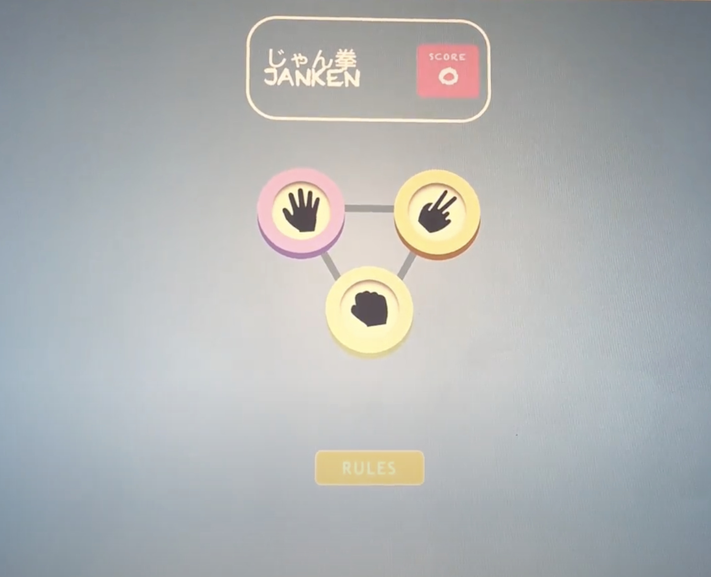

# README

# Rock-Paper-Scissors client-side web application

.png)

.png)

To begin, download the packages and then set up the local server listening to a port and configure the localhost parameter in vscode launch.json file.

